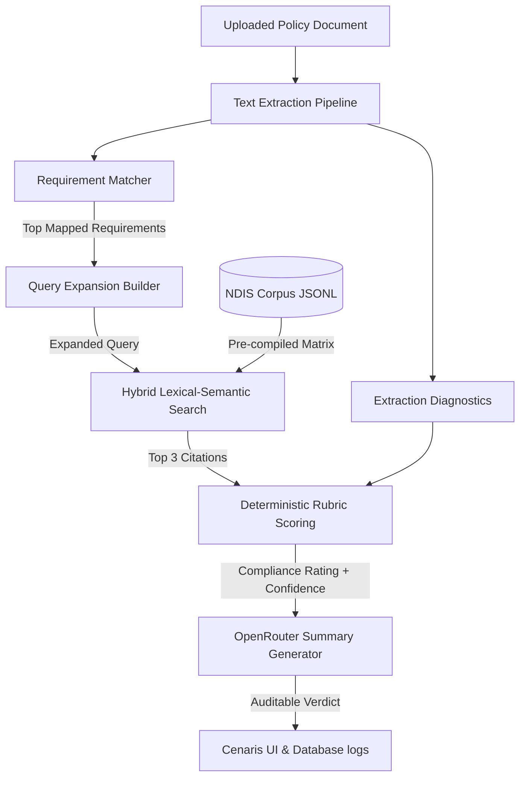

# Cenaris AI Review Engine: Technical Specification

This document provides a comprehensive technical overview of the AI-powered compliance review system in the Cenaris Compliance Platform. It outlines the document pre-processing pipelines, the Retrieval-Augmented Generation (RAG) implementation, the deterministic compliance-scoring rubrics, and the OpenRouter LLM integration.

---

## 1. Architectural Blueprint

The Cenaris AI Review Engine implements a hybrid deterministic-generative architecture. Rather than relying solely on raw LLM prompts (which are susceptible to hallucinations and lack auditing trails), the engine uses a layered pipeline:



---

## 2. Text Extraction & Diagnostics Pipeline

The engine extracts text from standard document formats and measures extraction quality before downstream scoring.

### Multi-Strategy PDF Parsing
PDF extraction runs sequentially through three engines to maximize recovery from complex tables and layouts:
1. **`pypdf`**: Fast, native text extraction.
2. **`fitz` (PyMuPDF)**: Fallback engine, superior at handling multi-column text blocks and layout structures.
3. **`pdfplumber`**: Final fallback engine, designed specifically to reconstruct text from tables and tabular forms.

The engine collects results from all successful parsers and selects the "richest" text based on total character count:
$$\text{Best Candidate} = \arg\max_{c \in \text{Candidates}} \text{len}(c)$$

### Docx & Binary Doc Parsing
* **`.docx`**: Parsed via the python-docx library by gathering paragraph elements and stripping leading/trailing whitespace.
* **`.doc`**: Legacy binary formats are parsed via a fallback binary scanner that extracts ASCII sequences of length $\ge 4$ and regex-sanitizes trailing binary junk.

### Extraction Quality Diagnostics
Before scoring, the engine calculates a **Text Density Ratio** to detect scanned PDFs (images without OCR) or corrupted files:
$$\text{Density} = \frac{\text{Extracted Characters}}{\text{Raw File Size (KB)}}$$

* **Low Quality**: Extracted characters $< 400$ OR Density $< 10.0$ chars/KB. This downgrades positive compliance statuses and limits confidence to a maximum of $0.58$.
* **Medium Quality**: Extracted characters $< 1200$ OR Density $< 20.0$ chars/KB. Triggering warnings in metadata logs.

---

## 3. RAG (Retrieval-Augmented Generation) Architecture

To justify its verdicts, the engine queries the local NDIS Practice Standards and Quality Indicators corpus.

### Chunking & Ingestion Strategy
* **Chunking Method**: Fixed-character sliding window segmented page-by-page.
* **Chunk Size**: $1200$ characters.
* **Overlap Size**: $180$ characters.
* **Corpus Storage**: Line-delimited JSON (`.jsonl`), where each row represents a chunk with its page number, source section, and text.

### Embedding Model & Caching
* **Embedding Model**: `all-MiniLM-L6-v2` (SentenceTransformer).
* **Embedding Dimension**: $384$.
* **Execution Caching**: Embedding matrices are pre-computed once and saved alongside the corpus in binary Numpy format (`_embeddings.npy` + `_embeddings_meta.json`). On subsequent requests, the cache is validated against the corpus file's modification time (`mtime`).

### Hybrid Lexical-Semantic Search Strategy
For any query, the engine computes a composite score for each chunk using a hybrid retriever:

```
Hybrid Score = (0.60 * Semantic Score) + (0.40 * Lexical Score) 
               + Topic Overlap Bonus + Requirement ID Boost
```

#### 1. Semantic Component
The query text is encoded using the same `all-MiniLM-L6-v2` instance. The semantic similarity is calculated using cosine similarity and shifted from $[-1, 1]$ to $[0, 1]$:
$$\text{Semantic Score} = \frac{\cos(\vec{u}, \vec{v}) + 1.0}{2.0}$$

#### 2. Lexical Component
The lexical retriever computes alphanumeric lowercase term matches:
* **Term Frequency (TF)**: Number of matches per unique query term, capped at $3.0$ per term to avoid keyword-stuffing skew.
* **Coverage Ratio**: $\frac{\text{Matched Terms}}{\text{Total Query Terms}}$.
* **Phrase Match**: $+1.8$ bonus for each query phrase matching a contiguous sequence in the chunk.
* **Normalization**: Divided by the maximum lexical raw score in the corpus to normalize to $[0, 1]$.

#### 3. Topic Overlap Bonus & Exact Match Boost
* **Topic Overlap**: Checks if the query and chunk overlap on 7 core domain topics (e.g. *behaviour_support*, *rights*, *complaints*).
  $$\text{Bonus} = \begin{cases} +0.12 \times \text{Overlap Count} & \text{if overlap} > 0 \\ -0.04 & \text{if no overlap} \end{cases}$$
* **Exact ID Match**: $+0.40$ boost if the target requirement ID (e.g. `NDIS-CM-1`) is explicitly found in the chunk's metadata or text.

---

## 4. Query Expansion & Prompt Engineering

To retrieve the most relevant standard clauses, the base assessment question is expanded prior to RAG search using a two-stage rule engine:

### 1. Topic-Based Expansions
The first 2,500 characters of the uploaded document and the question are scanned for keywords. If found, predefined terms are appended to the query:
* **Consent & Privacy**: `"participant rights privacy dignity information management consent"`
* **Complaints**: `"complaints management resolution participant feedback"`
* **Service Agreements**: `"service agreements with participants provision of supports responsive support provision"`
* **Support Planning**: `"support planning participant needs preferences goals risk assessments"`
* **Governance**: `"governance operational management risk management quality management information management"`

### 2. Requirement Metadata Injection
The metadata of the top matched NDIS requirement is appended directly to the end of the query:
`{requirement_id} {label} {module_name} {standard_name} {outcome_code} {quality_indicator_code}`

---

## 5. Deterministic Rubric-Based Scoring System

The compliance status is determined by a deterministic scoring formula assessing five independent signals (100 points total), rather than basic keyword-density metrics.

### The Five Signals
1. **Substance (40 pts)**: Detects operational language by checking indicators:
   * **Action Indicators** (e.g. *must, will, ensures, resolves, trained*): $\ge 6$ hits = full points.
   * **Responsibility Indicators** (e.g. *manager, board, coordinator, CEO*): $\ge 3$ hits = full points.
   * **Process Indicators** (e.g. *procedure, step, register, checklist*): $\ge 5$ hits = full points.
   * **Timeframes** (e.g. *within, days, monthly, quarterly*): $\ge 2$ hits = full points.
2. **Coverage (25 pts)**: Calculates query keyword overlap. To prevent minor word mismatches from ruining scores, a sub-linear square-root transformation is applied:
   $$\text{Coverage Score} = (\text{Coverage Ratio})^{0.6} \times 25.0$$
3. **Depth (20 pts)**: Rewards comprehensive writing by checking document character length (weighted at 60%) and the presence of extractable evidence snippets (weighted at 40%).
4. **Structure (10 pts)**: Analyzes document formatting (e.g., numbered lists, section headers).
5. **Snippet Quality (5 pts)**: Evaluates the density of strong contextual evidence blocks matching the query.

### Relevance Gates (Score Slashes)
To prevent generic business documents from matching compliance language by accident, the raw score is passed through multiplicative relevance gates:
* **Domain Anchor Gate**: Checks for 22 core compliance words (e.g., *ndis, participant, consent, safeguard*).
  $$\text{Multiplier} = \begin{cases} 0.55 \text{ (45\% slash)} & \text{if anchors} \le 1 \\ 0.78 \text{ (22\% slash)} & \text{if anchors} \le 3 \\ 1.00 & \text{if anchors} \ge 4 \end{cases}$$
* **Coverage Gate**: If the document covers less than 20% of the query terms, a $20\%$ slash is applied (`relevance_gate *= 0.80`).
* **Irrelevance Penalty**: If the document triggers resume or financial invoice classifiers, the final raw score is hard-capped at $0.22$.

### Template Detection & Calibration
The engine scans for indicators of uncompleted documents:
* **Markers**: Bracketed placeholders (`[...]`, `<...>`, `{...}`), blank lines (`____`, `....`), and unfilled labels (`Name:`, `Date:`).
* **Triggers**: A template is flagged if there are $\ge 12$ total markers, if the word-to-marker ratio is $< 40$, or if the document is short ($< 300$ words) and has $\ge 4$ markers.
* **Calibration Impact**:
  * Down-grades `Mature` or `OK` to `High risk gap`.
  * Caps `Mature` confidence at $0.52$.
  * Caps `OK` confidence at $0.50$.
  * Adds a citation alignment bonus of $+0.04$ confidence if $\ge 2$ NDIS RAG citations are retrieved.

---

## 6. LLM Summary Generation (OpenRouter API)

Once status and confidence are calculated, the engine calls the OpenRouter API to draft an auditor-friendly narrative summary.

### API Call Strategy & Resilience
* **System Prompt**: `"Be practical, precise, and avoid legal conclusions."`
* **Temperature**: `0.1` (low temperature to enforce deterministic, grounded text extraction summaries).
* **API Fallbacks**: The system attempts completions using the configured OpenRouter model (defaulting to `mistralai/mistral-7b-instruct:free`) and fallbacks to `openrouter/auto`.
* **Token Budgets**: If requests fail or time out, the engine automatically retries with smaller token window limits ($700 \rightarrow 350 \rightarrow 180$ tokens) to minimize latency and ensure response completion.
* **Sentence Extraction**: If OpenRouter fails, the engine falls back to a deterministic template using localized string interpolation of the top-matching evidence snippets and NDIS standards.

---

## 7. Performance & Latency Profile

The system runs on the following execution latency breakdown:

| Sub-phase | Target Duration | Dependencies | Bottleneck Risk |
| :--- | :--- | :--- | :--- |
| **Text Extraction** | 50ms – 200ms | File layout complexity | PyMuPDF/pdfplumber fallback |
| **Embedding Generation** | 20ms – 50ms | SentenceTransformer (CPU) | First run model loading (3s) |
| **RAG Retrieval** | 10ms – 40ms | Memory caching (`.npy`) | Array scaling (minimal at <10K chunks) |
| **Scoring Logic** | 1ms – 5ms | In-memory operations | None |
| **LLM Summary** | 1.00s – 2.50s | OpenRouter API | Network latency, API throttling |
| **Total (End-to-End)** | **1.10s – 2.80s** | Chained pipeline | Remote API completions |
