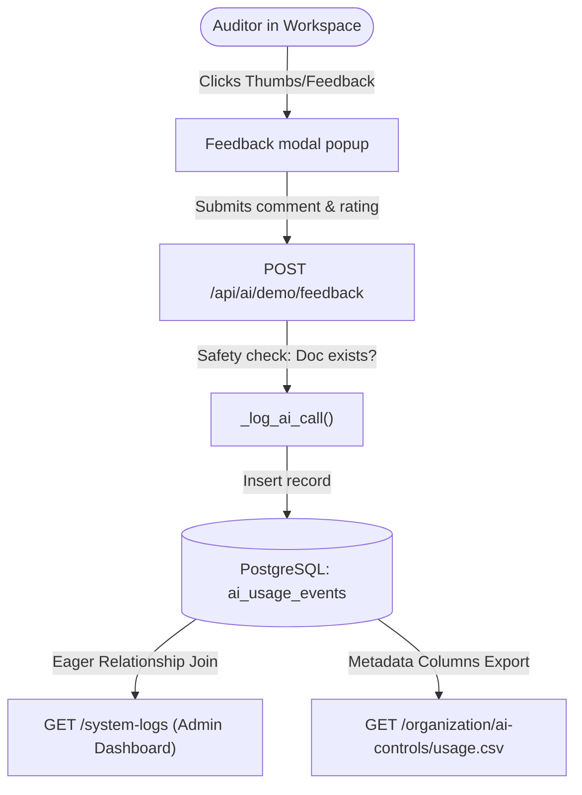

# AI Review Feedback Tracking System

This documentation explains the implementation, architecture, and developer workflows for the centralized **AI Review Feedback System** in the Cenaris Compliance Platform. 

This system enables auditors to provide detailed, qualitative feedback on AI compliance scoring. The data is consolidated inside our existing database structure at **zero additional cloud hosting cost**, giving developers and admins a clear auditing trail to continuously improve the RAG prompts and scoring profiles.

---

## 1. Architectural Overview

The system captures user responses to AI-generated reviews (Proposed Status, Gaps, Confidence) and pipes them into a unified table to maintain high reliability and performance:



---

## 2. Database Schema (`AIUsageEvent`)

The `AIUsageEvent` table is extended to support granular feedback capture. All new columns are nullable to maintain 100% backward compatibility with traditional usage logging.

### Extended Columns in `app/models.py`

| Column | Type | Constraints | Description |
| :--- | :--- | :--- | :--- |
| **`document_id`** | `Integer` | Foreign Key (`documents.id`, `ondelete='SET NULL'`) | The target document being reviewed. Set to NULL if the document is deleted, preserving the log. |
| **`feedback_status`** | `String(80)` | Nullable | The AI's compliance status rating when reviewed (e.g., `Mature`, `Gap`). |
| **`feedback_confidence`** | `Float` | Nullable | The AI's confidence rating when reviewed (e.g., `0.85`). |
| **`feedback_reason`** | `Text` | Nullable | Detailed, qualitative reviewer notes explaining why they flagged this status. |

### Relationships
*   `document`: Accesses the `Document` object to fetch file names (`event.document.filename`).
*   `user`: Accesses the `User` auditor object to fetch names/emails.

---

## 3. Detailed Workflows

### Step A: Auditor Submits Feedback (Front-End)
Inside the **AI Review Workspace** ([ai_demo.html](file:///c:/Users/DELL/Desktop/cenaris/app/templates/main/ai_demo.html)):
1. After running a compliance analysis, three action buttons are available: **Mark False Positive**, **Mark False Negative**, and **Mark Correct**.
2. Clicking any button launches a beautiful modern Bootstrap Modal popup.
3. The popup asks: *"Would you like to add any notes or details about this feedback?"*
4. The auditor enters optional comments (e.g., *"The AI missed Section 3 which states review frequency."*) and clicks **Submit**.
5. The `sendFeedback()` JavaScript function bundles the text reason along with the analysis metadata and makes a POST request to `/api/ai/demo/feedback`.
6. *(Resilience Feature)*: If the Bootstrap library fails to initialize in the client browser, the script automatically falls back to a clean browser `prompt()`, guaranteeing that feedback is **never lost**.

### Step B: Ingestion and Safety Checks (Back-End)
The endpoint [ai_demo_feedback_api](file:///c:/Users/DELL/Desktop/cenaris/app/main/routes.py#L6895) in `app/main/routes.py` processes the request:
1. **Authentication & Authorization:** Verifies that the active organization is loaded and the user has permission.
2. **Referential Integrity Validation:** The system queries the database to confirm that the `stored_doc_id` sent by the client actually exists. If it does not exist, it sets `doc_id_int = None` instead of raising an database integrity violation.
3. **Database Write:** Calls the centralized helper `_log_ai_call()` which writes the event and commits it safely.

### Step C: Viewing in the Admin Dashboard
Organization administrators can view and audit reviews inside the **Audit Logs** dashboard ([system_logs.html](file:///c:/Users/DELL/Desktop/cenaris/app/templates/main/system_logs.html)):
*   The `system_logs` route eagerly loads the target document and the user model in a single query.
*   The **AI Events** log lists the auditor, timestamp, and friendly action name (e.g. `Feedback: False Positive`).
*   Clicking **View Details** opens a detailed modal showing the evaluated document's filename, the AI confidence rating, and the reviewer's qualitative notes.

---

## 4. Edge Cases: History vs. Current Verdict

### Multi-Submission History
If a user submits feedback on the same document multiple times (e.g., first marking it as **Correct** and later as a **False Positive**):
*   **Audit Logging:** The system saves **both clicks** as individual events in the database to maintain a full history.
*   **Determining the Active Verdict:** To see the active or current review state of a document, query the **most recent** event for that document id:
    ```python
    latest_feedback = (
        AIUsageEvent.query
        .filter_by(document_id=doc_id)
        .order_by(AIUsageEvent.created_at.desc())
        .first()
    )
    ```

---

## 5. How Developers/DevOps Can Use Feedback to Improve the Model

For the engineering team, these auditor reviews represent the **primary dataset** to train and fine-tune the compliance algorithms. 

### Method A: One-Click Excel/CSV Export
Devs can download all logging history at the [organization_ai_usage_csv](file:///c:/Users/DELL/Desktop/cenaris/app/main/routes.py#L3196) route (`/organization/ai-controls/usage.csv`). The CSV schema now automatically includes the feedback metadata:
*   Open `/organization/ai-controls/usage.csv` in Excel or pandas.
*   Filter by `event` in `[ai_review_feedback_false_positive, ai_review_feedback_false_negative]`.
*   You will see an exact spreadsheet of all failed predictions and the corresponding auditor explanations.

### Method B: Improving Prompts and Anchor Lists
*   **False Positives:** Look at the comments. If auditors complain that the AI graded irrelevant files (e.g. invoices, resumes) as "Mature", we can adjust the **Irrelevant Document constraints** in the scoring algorithm.
*   **False Negatives:** If the AI missed crucial policies, check the document's text chunking and RAG retriever configuration to improve coverage.
*   **Scoring Calibration:** Use the exported score vs. actual reviewer notes to tune the scoring threshold sliders in `/api/ai/demo/scoring-profile`.

---

## 6. Primary Codebase Locations

*   **Database Schema Class:** [AIUsageEvent](file:///c:/Users/DELL/Desktop/cenaris/app/models.py#L695) in `app/models.py`
*   **Ingestion Endpoint:** [ai_demo_feedback_api](file:///c:/Users/DELL/Desktop/cenaris/app/main/routes.py#L6895) in `app/main/routes.py`
*   **Admin Dashboard Logs Query:** [system_logs](file:///c:/Users/DELL/Desktop/cenaris/app/main/routes.py#L8240) in `app/main/routes.py`
*   **One-Click CSV Export:** [organization_ai_usage_csv](file:///c:/Users/DELL/Desktop/cenaris/app/main/routes.py#L3196) in `app/main/routes.py`
*   **Front-End Dialog & Modal:** [ai_demo.html](file:///c:/Users/DELL/Desktop/cenaris/app/templates/main/ai_demo.html)
*   **Automated Verification Suite:** [test_ai_review_feedback_api_persists_usage_event](file:///c:/Users/DELL/Desktop/cenaris/tests/test_ai_review_workspace.py#L275) in `tests/test_ai_review_workspace.py`
